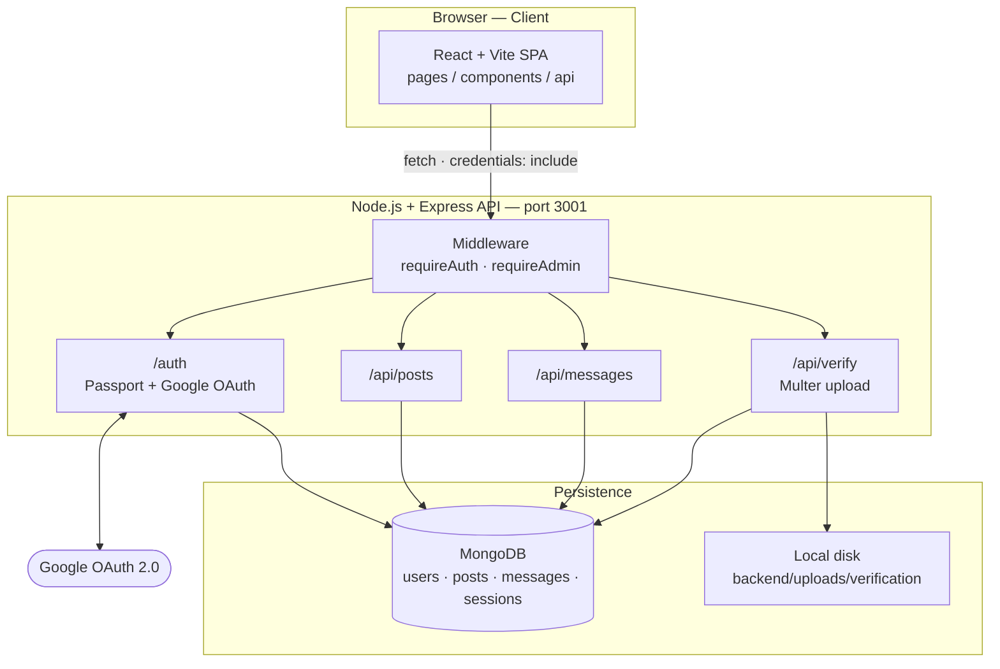
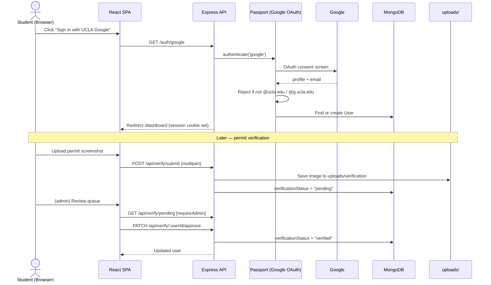
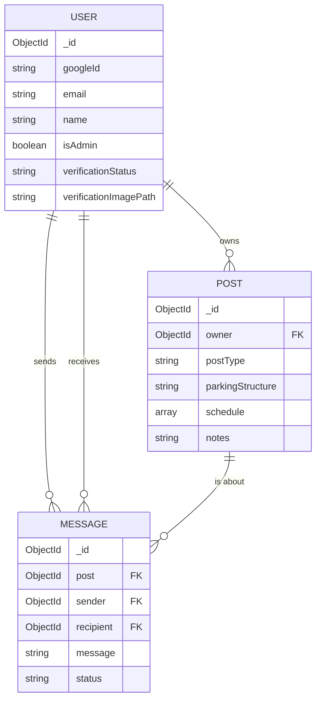

# BruinPark

BruinPark is a web application that helps UCLA commuter students save money by sharing parking permits, by matching users with other commuters with non-overlapping schedules. Users authenticate with their UCLA Google account, and can create a parking post to describe what structure their are assigned, what time they need to be on campus, and extra notes section for extra requirements. Students are able to send messages directly to each other within the app to further coordinate sharing a permit.


## Features:
- UCLA only sign in via Google OAuth 2.0 (`@ucla.edu` and `@g.ucla.edu`)
- Create, edit and delete parking posts
- Browse and filter posts based on day of the week and parking structure
- Send message requests with other students
- Permit verification by uploading a screenshot of their confirmation email
- Admin dashboard to verify permits


## Tech Stack:
- **Frontend**: React + Vite
- **Backend**: Node.js + Express
- **Database**: MongoDB (via Mongoose)
- **Authentication**: Google OAuth 2.0 + Passport.js
- **Sessions**: express-session stored in MongoDB via connect-mongo
- **File Uploads**: Multer

## Architecture:

BruinPark is a two-tier web application: a React single-page app talks to a stateless
Express REST API, which persists everything in MongoDB and stores uploaded permit
screenshots on the server's local disk. Authentication is delegated to Google OAuth 2.0
and tracked with a session cookie. The three diagrams below describe the system from three
complementary angles — its runtime components, the flow of a key user journey, and the
shape of the stored data — and are consistent with one another and with the code.

### 1. System Architecture (Component Diagram)

This diagram shows the major runtime pieces and how a request travels from the browser,
through the Express routers and auth middleware, out to MongoDB, the local file system, and
Google. Every authenticated `/api/*` request first passes through `requireAuth`, and the
admin-only verification routes additionally pass through `requireAdmin`.



### 2. Login + Permit Verification Flow (Sequence Diagram)

This diagram traces the two security-critical journeys end to end: signing in with a UCLA
Google account (where non-UCLA emails are rejected before any session is created), and the
permit verification lifecycle where a student uploads a screenshot and an admin approves or
rejects it. It shows exactly which component reads or writes state at each step.



### 3. Data Model (Entity-Relationship Diagram)

This diagram shows the three core Mongoose collections and how they reference each other. A
`User` owns many `Post`s; a `Message` (the message-request record) links a `Post` to the
`sender` and `recipient` users that are coordinating a permit share.



## Repository Structure:
```
bruinpark/
    backend/
        config/
        middleware/
        models/
        routes/
        uploads/
        index.js
        package.json
    frontend/
        src/
            api/
            components/
            hooks/
            pages/
            styles/
            utils/
            App.css
            App.jsx
            index.css
            main.jsx
        package.json
```

## Prerequisites:
1. Node.js v18 or higher
2. npm
3. MongoDB either locally on `mongodb://localhost:27017` or a Mongo atlas cluster (free)
4. Google OAuth 2.0 credentials

## Setup:
1. Clone the repository
```bash
git clone <https://github.com/shyam7nj/bruinpark.git>
cd BruinPark
```

2. Setup Google OAuth credentials
    - `Go to https://console.cloud.google.com/` 
    -  Create a new project
    - Go to `APIs & Services` -> `OAuth consent screen` -> Choose external and fill in basic info
    - Go to `APIs & Services` -> `Credentials` -> `Create credentials` -> `OAuth client ID`
    - Choose `Web Application`
    - Under `Authorized JavaScript origins` add: `http://localhost:5173`
    - Under `Authorized redirect URIs` add: `http://localhost:3001/auth/google/callback`
    - Save a copy of `Client ID` and `Client Secret`

3. Configure .env variables
```env
GOOGLE_CLIENT_ID= <client ID from previous step>
GOOGLE_CLIENT_SECRET= <client secret from previous step>
MONGO_URI= <mongo connection string>
SESSION_SECRET= <any random long string>
CLIENT_URI= <http://localhost:5173>
```
4. Install dependencies (two terminals needed)
```bash
cd backend
npm install
```

```bash
cd frontend
npm install
```

5. Start the backend and frontend (two terminals needed)
```bash
cd backend
npm run dev
```

```bash
cd frontend
npm run dev
```

6. Open the app
- Open `http://localhost:5173` in whatever browser of your choice and login with your UCLA email


7. (Optional) Access Admin Page
- The admin verificaiton page is only accessible to users with the `isAdmin` flag set to true, and must be done directly in the database.
- Locate the collection that stores all the users in MongoDB. Then, manually edit `isAdmin` to true, and save. It will likely be in a folder called `users`.
- Refresh and you should see the option to review permit verifications. 

